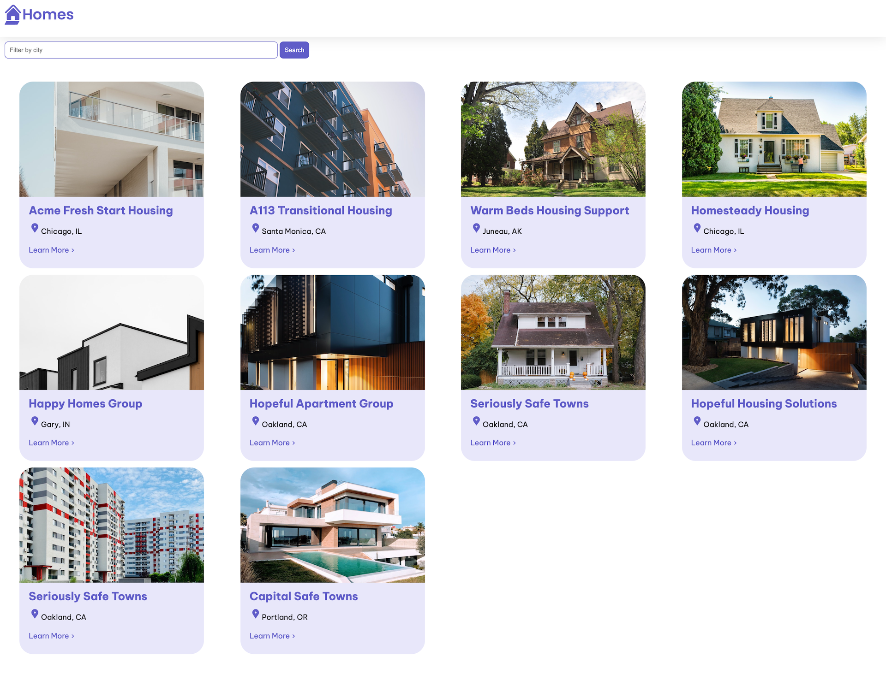

# Homes

This project was generated with [Angular CLI](https://github.com/angular/angular-cli) version 17.0.9.

It's based on an [official tutorial](https://angular.io/tutorial/first-app) of Angular.

This site is used to rent apartments in a fictitious way.

## Development server

First, run `npm install` to install nodes modules.

Then, run `ng serve --open` for a dev server. The application will automatically reload if you change any of the source files.

## Made with ❤️

Features not included in the official project have been developed with **[@Daria Karpenko](https://github.com/karpetoryba)**, **[@Cassandra Delmas Marchiset](https://github.com/CassandraDM)** and **[@Lucas Leveque](https://github.com/1u1ucas)**
